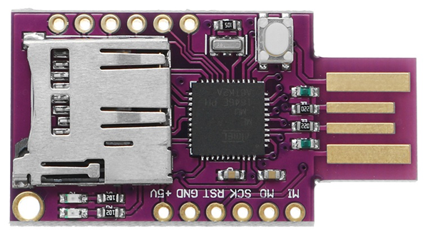

# BadUSB — ATMEGA32U4 keyboard emulator

Firmware for the **CJMCU-32 (ATMEGA32U4)** board that turns it into a
programmable USB keyboard emulator (HID). Once plugged into a computer, the
device replays keystroke sequences stored on a microSD card using a syntax
similar to **DuckyScript** (Rubber Ducky).



The project is intended for **authorized security testing, red-team exercises,
education and research** — see the [Legal disclaimer](#legal-disclaimer).

---

## Table of contents

- [BadUSB — ATMEGA32U4 keyboard emulator](#badusb--atmega32u4-keyboard-emulator)
  - [Table of contents](#table-of-contents)
  - [Hardware](#hardware)
  - [Dependencies](#dependencies)
  - [Build and flash](#build-and-flash)
    - [Arduino IDE](#arduino-ide)
    - [arduino-cli](#arduino-cli)
  - [Repository layout](#repository-layout)
  - [SD card contents](#sd-card-contents)
  - [Operating modes (`MODE.cfg`)](#operating-modes-modecfg)
  - [Payload syntax](#payload-syntax)
    - [Timing control](#timing-control)
    - [Text](#text)
    - [Modifier keys / chords](#modifier-keys--chords)
    - [Special keys (no argument)](#special-keys-no-argument)
    - [Example](#example)
    - [Validating payloads](#validating-payloads)
  - [Management mode](#management-mode)
  - [Character map (`LANG.cfg`)](#character-map-langcfg)
  - [LED signalling](#led-signalling)
  - [Troubleshooting](#troubleshooting)
  - [Legal disclaimer](#legal-disclaimer)
  - [License](#license)

---

## Hardware

| Component            | Description                                                 |
| -------------------- | ----------------------------------------------------------- |
| Microcontroller      | CJMCU-32 / ATMEGA32U4 (native USB HID)                      |
| microSD reader       | SPI module                                                  |
| `chipSelect`         | pin **4** (SPI CS of the SD reader)                         |
| Status LED           | pin **8** (`led2`) — payload/error signalling               |
| Built-in LED         | `LED_BUILTIN`                                               |

The SD module is connected over SPI (MISO/MOSI/SCK) plus the CS line on pin 4.
If needed, change `const int chipSelect` in [`badusb.ino`](badusb.ino).

## Dependencies

Standard libraries from the Arduino AVR Core:

- `Keyboard.h`
- `SPI.h`
- `SD.h`

> **Note:** the `SD` library supports **8.3** file names and is case-insensitive.
> Keep file names short (e.g. `PAYLOAD.txt`).

## Build and flash

> **Important:** Arduino requires the main sketch file name to match its folder
> name. The main sketch is [`BadUSB.ino`](BadUSB.ino), so keep it inside a folder
> named `BadUSB/` (this is how the repository is laid out). If you rename one,
> rename the other to match, otherwise the IDE / `arduino-cli` will refuse to
> open the sketch.

### Arduino IDE

1. Install **Arduino AVR Boards**.
2. Select an ATMEGA32U4-compatible board (e.g. *Arduino Leonardo* / *Micro*).
3. Open [`BadUSB.ino`](BadUSB.ino), compile and upload.

### arduino-cli

```bash
# Point at the sketch folder (recommended) or at BadUSB/BadUSB.ino
arduino-cli compile --fqbn arduino:avr:leonardo BadUSB
arduino-cli upload  --fqbn arduino:avr:leonardo -p COM3 BadUSB
```

Verified with `arduino:avr` core 1.8.6 (arduino-cli 1.5.1): compiles clean,
~77% flash and ~72% RAM on the ATMEGA32U4.

> If, right after flashing, the board immediately starts sending keystrokes and
> makes reprogramming difficult, set `MODE.cfg` to `m` (management mode) before
> inserting the card, or upload while triggering the bootloader (double reset).

## Repository layout

| File            | Description                                                        |
| --------------- | ------------------------------------------------------------------ |
| `BadUSB.ino`    | Main sketch: setup/loop, management mode, payload parser & dispatch. |
| `keys.h`        | HID key-code constants (`#ifndef`-guarded against `Keyboard.h`).    |
| `keymap.h`      | Public interface of the character-map module.                      |
| `keymap.cpp`    | `LANG.cfg` loader and byte translation (`loadKeymap`, `convertLangChar`). |
| `SD/`           | Ready-to-copy SD card contents (config files and payloads).        |
| `SD/examples/`  | Extra per-OS example payloads (`WIN.txt`, `LINUX.txt`, `MAC.txt`).  |
| `tools/`        | `payload_lint.py` — offline payload validator (see below).         |

All four source files live in the sketch folder, so Arduino IDE / `arduino-cli`
compile them together automatically — no extra configuration needed.

## SD card contents

The root of the microSD card (FAT/FAT32) should contain:

| File          | Required | Description                                                  |
| ------------- | -------- | ------------------------------------------------------------ |
| `MODE.cfg`    | yes      | Operating mode: `c`, `a` or `m` (see below).                 |
| `EXEC.cfg`    | yes      | Name of the payload file to run (e.g. `PAYLOAD.txt`).        |
| `LANG.cfg`    | no       | Optional character map for non-US layouts.                   |
| *payload*     | yes      | Text file with the script (name given in `EXEC.cfg`).        |

A ready-to-copy set is provided in the [`SD/`](SD/) directory — copy its
contents to the root of the card. The default `PAYLOAD.txt` is a parser
feature showcase.

Extra per-OS payloads live in [`SD/examples/`](SD/examples/): `WIN.txt`
(Windows), `LINUX.txt` (Linux) and `MAC.txt` (macOS). To run one, copy it into
the card root as `PAYLOAD.txt` (replacing the default), so `EXEC.cfg` keeps
pointing at the payload next to it.

## Operating modes (`MODE.cfg`)

`MODE.cfg` contains a single character:

| Value | Mode                | Behavior                                                                  |
| ----- | ------------------- | ------------------------------------------------------------------------- |
| `c`   | **continuous**      | Replays the payload on every connection.                                  |
| `a`   | **auto-disarm**     | Replays the payload **once**, then automatically switches `MODE.cfg` to `m`. |
| `m`   | **management**      | Does not replay the payload — starts a configuration menu over serial.    |

Mode `a` is convenient for safe testing: the device "disarms" itself after the
first run and waits for configuration on the next connection.

## Payload syntax

A payload is a text file, one command per line. All common line endings are
supported — **LF** (`\n`), **CRLF** (`\r\n`) and legacy **CR** (`\r`). Empty
lines are ignored.

### Timing control

| Command                    | Description                                                 |
| -------------------------- | ----------------------------------------------------------- |
| `DELAY <ms>`               | Pause in milliseconds.                                       |
| `DEFAULT_DELAY <ms>`       | Fixed pause before **every** subsequent command (alias `DEFAULTDELAY`). |
| `REM <text>`               | Comment — the line is ignored.                               |

### Text

| Command            | Description                                                         |
| ------------------ | ------------------------------------------------------------------- |
| `STRING <text>`    | Types the given string (no trailing Enter).                         |
| `STRINGLN <text>`  | Types the given string, then presses Enter.                         |

### Modifier keys / chords

Modifiers can be chained and are followed by an optional final key, which may be
a **single character** or a **named key** (see the special-key list below).

| Modifier            | Sends                                              |
| ------------------- | -------------------------------------------------- |
| `CTRL` / `CONTROL`  | Left Ctrl                                          |
| `ALT`               | Left Alt                                           |
| `SHIFT`             | Left Shift                                          |
| `GUI` / `WINDOWS`   | Left Super (Windows key)                           |
| `CTRLALT`           | Left Ctrl + Left Alt (legacy shortcut for `CTRL ALT`) |

Examples:

```text
GUI r                 # Win + R
CTRL c                # copy
ALT F4                # close window  (named key as the final key)
CTRLALT t             # open a terminal (Linux)
CTRL ALT DELETE       # chained modifiers + named key
GUI                   # tap the Windows key alone (no argument)
```

### Special keys (no argument)

`ENTER`, `MENU`/`APP`, `SPACE`, `TAB`, `ESC`/`ESCAPE`, `CAPSLOCK`, `BACKSPACE`,
`DELETE`, `INSERT`, `HOME`, `END`, `PAGEUP`, `PAGEDOWN`, `NUMLOCK`, `SCROLLLOCK`,
`PRINTSCREEN`, `BREAK`/`PAUSE`, `UP`/`UPARROW`, `DOWN`/`DOWNARROW`,
`LEFT`/`LEFTARROW`, `RIGHT`/`RIGHTARROW`, `F1`–`F12`.

### Example

```text
DELAY 2000
GUI r
DELAY 500
STRING notepad
ENTER
DELAY 800
STRING Hello from BadUSB!
```

> The maximum command-name length is 16 characters. Unrecognized commands are
> skipped and turn on the error LED in management mode.

### Validating payloads

`tools/payload_lint.py` checks a payload **on your PC** before you copy it to
the SD card. It reproduces the firmware's token grammar (`dispatchCommand`,
`delivery` and `runCombo` in [`BadUSB.ino`](BadUSB.ino)), so a payload that
lints clean will not trip the device's unknown-command error flag.

```bash
python tools/payload_lint.py SD/PAYLOAD.txt
# check several at once:
python tools/payload_lint.py SD/PAYLOAD.txt SD/examples/*.txt
```

It reports three levels and exits non-zero on any **ERROR** (handy in CI):

- **ERROR** — the firmware would reject the line (unknown command, a bare single
  character used as a command, an invalid chord key).
- **WARN** — the line runs but likely not as intended (command name over 16
  chars gets truncated, non-integer `DELAY` argument, tokens ignored after a
  chord's final key, non-ASCII `STRING` bytes).
- **note** — harmless, informational.

Needs only Python 3 (no external packages).

## Management mode

When `MODE.cfg` = `m`, after insertion the device waits for a serial port to be
opened (**9600 baud**). Once connected, the serial monitor shows:

1. a list of available files (payloads) on the card,
2. the available modes,
3. the current mode and payload,
4. a prompt to enter a **new mode** (`c`/`a`/`m`), saved to `MODE.cfg`,
5. a prompt to enter the **name of a new payload**, saved to `EXEC.cfg`.

This lets you reconfigure the device without removing the SD card.

## Character map (`LANG.cfg`)

By default the firmware sends characters as if the host used the **US** layout.
For other layouts you can remap individual bytes in the `LANG.cfg` file.

Format: one entry per line, three decimal numbers separated by commas:

```text
in,modifier,out
```

- `in` — input byte code (0–255), as in the payload (e.g. from `STRING`),
- `modifier` — key pressed together with `out` (`0` = none; e.g. `134` = Right Alt / AltGr),
- `out` — byte/key code actually sent to the host.

Modifier codes:

| Code | Key              | Code | Key                   |
| ---- | ---------------- | ---- | --------------------- |
| 128  | KEY_LEFT_CTRL    | 132  | KEY_RIGHT_CTRL        |
| 129  | KEY_LEFT_SHIFT   | 133  | KEY_RIGHT_SHIFT       |
| 130  | KEY_LEFT_ALT     | 134  | KEY_RIGHT_ALT (AltGr) |
| 131  | KEY_LEFT_GUI     | 135  | KEY_RIGHT_GUI         |

Rules:

- empty lines and lines starting with `#` are skipped,
- up to **64** active entries,
- missing file or no entries ⇒ *passthrough* mode (no remapping).

> **Limitation:** mapping only works on single bytes (0–255). Multi-byte UTF-8
> characters (e.g. Polish `ą` = `0xC4 0x85`) will not work without code changes —
> keep payloads in ASCII.

See the example: [`SD/LANG.cfg`](SD/LANG.cfg).

## LED signalling

- After a payload finishes, the LED on pin 8 lights up for ~0.5 s.
- In management mode the LED stays on while waiting for the serial port;
  blinking (200 ms) indicates a parsing error detected in the previous payload.

## Troubleshooting

| Symptom                                 | Possible cause / fix                                             |
| --------------------------------------- | ---------------------------------------------------------------- |
| `Card failed, or not present`           | Wrong CS line, missing/damaged card, wrong format (use FAT32).   |
| `No payload configured`                 | Empty/missing `EXEC.cfg`.                                        |
| Payload misbehaves                      | Check the host keyboard layout and `LANG.cfg`; keep payloads ASCII. |
| Cannot reflash the firmware             | Set mode `m` or use the bootloader (double reset).              |
| Wrong character instead of expected one | Keyboard layout mismatch — configure `LANG.cfg`.               |

## Legal disclaimer

This is a **dual-use** tool provided **solely** for lawful purposes: authorized
penetration testing, red-team exercises, security research and education.

**Use it only on hardware you own or with the explicit written permission of the
owner.** Unauthorized access to computer systems and interception of data are
illegal in most jurisdictions (in Poland, among others, Art. 267 and 269b of the
Penal Code). The author accepts no liability for any damage or misuse of this
software. All responsibility rests entirely with the user.

## License

Released under the **MIT** license — see the [`LICENSE`](LICENSE) file.

© 2026 Mateusz "Maku" Mączewski
